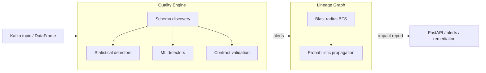

# DataShield

**Real-time data-observability platform: a data-quality engine, lineage / blast-radius tracking, and ML anomaly detection, exposed over a FastAPI service.**

[](https://www.python.org/downloads/)
[](https://fastapi.tiangolo.com/)
[](#testing--honest-metrics)
[](#license)

DataShield watches tabular data flowing through a pipeline and answers three questions in one pass:

1. **Is this batch broken?** Statistical and ML detectors flag row-count spikes, null explosions, cardinality collapse, distribution shift, schema drift, and PII leakage.
2. **What else breaks if it is?** A lineage graph computes the downstream blast radius (which tables, dashboards, and models are affected) and the probability that the failure propagates to each.
3. **Who needs to know, and can we auto-fix it?** Severity-ranked escalation plus a remediation engine for the cases that have a safe automated response.

It runs three ways with increasing infrastructure: a **zero-dependency demo**, a **full FastAPI service** (Postgres-backed, with a graceful in-memory fallback), and a **streaming mode** (Kafka + Postgres via Docker Compose).

---

## TL;DR — Quickstart

> Commands assume the repo's local virtualenv at `./venv`. Substitute your own interpreter if you manage environments differently.

```bash
# 0. Setup (once)
python3 -m venv venv
./venv/bin/pip install -r requirements.txt
```

### 1. Zero-infra demo (no Postgres, no Kafka)

The fastest way to see every layer working. A self-contained Flask app wires the quality engine, lineage graph, and ML detector against in-memory sample data and serves an interactive UI.

```bash
./venv/bin/python demo_server.py
# then open http://localhost:5000
```

Click through the scenarios: scan healthy data, inject a row spike / null explosion / schema drift, simulate a failure to see the blast radius, and run the four ML detectors. Nothing external is required.

### 2. Full API service

```bash
./venv/bin/uvicorn src.api.main:app --port 8000
# interactive docs: http://localhost:8000/docs
```

The API prefers a Postgres connection (`DATABASE_URL`) for lineage persistence and **falls back to in-memory state when Postgres is absent**, so it will boot for a demo. OpenTelemetry tracing self-disables if no OTLP collector is reachable. See the [dependency matrix](#dependency-matrix) for what works in each mode.

### 3. Streaming mode (Kafka + Postgres)

```bash
docker compose up                       # core: postgres + api
docker compose --profile streaming up   # + Kafka, Zookeeper, Schema Registry, Kafka UI
docker compose --profile full up        # everything incl. Jaeger, Prometheus, Grafana
```

`docker compose config` validates cleanly.

### 4. Tests

```bash
./venv/bin/python -m pytest tests/unit tests/integration -q
# 22 passed in ~1.5s — no infra required
```

---

## The problem

Data pipelines fail silently. A schema changes upstream, an ETL job double-runs, a column starts arriving 80% null — and nothing throws an error. The bad data lands in a warehouse, flows into dashboards and ML features, and the first signal is a confused stakeholder hours later. By then the question isn't just "what broke" but "what did it touch."

Most quality tooling answers only the first half. You learn a table is bad but not which of your 200 downstream assets just inherited the problem, or which incident deserves the on-call page versus a ticket.

DataShield couples **detection** with **lineage-aware impact analysis** so a single bad batch produces a ranked, scoped answer: what failed, what it cascades into, how likely, and how urgent.

---

## Architecture

```
                      ┌─────────────────────────────────────────────┐
   Events / batches   │              QUALITY ENGINE                 │
   (Kafka topic or    │   Schema discovery → baseline metadata      │
    direct DataFrame) │   Statistical detectors (8 checks)          │
        ─────────────►│   ML detectors (Isolation Forest, LOF,      │
                      │     temporal, multivariate)                 │
                      │   Contract validation                       │
                      └───────────────────┬─────────────────────────┘
                                          │ alerts (typed, severity-ranked)
                                          ▼
                      ┌─────────────────────────────────────────────┐
                      │              LINEAGE GRAPH                  │
                      │   Dependency tracking (tables → tables)     │
                      │   Blast radius (BFS over the graph)         │
                      │   Probabilistic propagation (latency-aware) │
                      │   Escalation routing by criticality         │
                      └───────────────────┬─────────────────────────┘
                                          │ impact report
                                          ▼
                      ┌─────────────────────────────────────────────┐
                      │           FastAPI SERVICE / ALERTS          │
                      │   REST endpoints + /docs (OpenAPI)          │
                      │   Remediation engine (auto-fix where safe)  │
                      │   OpenTelemetry traces → Jaeger (optional)  │
                      └─────────────────────────────────────────────┘
```



---

## Dependency matrix

Not every feature needs every service. This table is the contract for what runs in each mode.

| Capability | Standalone (demo / library) | Needs Postgres | Needs Kafka | Notes |
|---|:---:|:---:|:---:|---|
| Schema discovery | ✅ | — | — | Pure pandas/NumPy |
| Statistical anomaly detection (8 checks) | ✅ | — | — | scipy + pandas |
| ML anomaly detection (4 methods) | ✅ | — | — | scikit-learn |
| Contract registration & validation | ✅ | — | — | In-memory registry |
| Lineage graph + blast radius | ✅ | optional | — | In-memory by default; Postgres persists it |
| Probabilistic propagation | ✅ | optional | — | Runs on the in-memory graph |
| Remediation engine | ✅ | — | — | Operates on detected alerts |
| `demo_server.py` (full UI walkthrough) | ✅ | — | — | Flask, port 5000, sample data baked in |
| FastAPI service + `/docs` | ✅ (fallback) | recommended | — | Boots without Postgres via in-memory fallback |
| Persisted lineage across restarts | — | ✅ | — | `DATABASE_URL` → Postgres |
| Streaming ingestion (real-time consume) | — | ✅ | ✅ | `--profile streaming`; Schema Registry for Avro |
| Distributed tracing (Jaeger) | — | — | — | Optional OTLP collector; auto-disabled if absent |

**Rule of thumb:** the entire detection + lineage core is pure Python and runs standalone. Postgres buys you persistence; Kafka buys you real-time streaming. Everything degrades gracefully when those are missing.

---

## API surface

The FastAPI app (`src/api/main.py`, v0.3.0) exposes the full platform. Highlights:

| Method & path | Purpose |
|---|---|
| `GET /health` | Component readiness (quality engine, lineage, ML, contracts, tracing) |
| `POST /api/quality/discover` | Learn a baseline schema for a table |
| `POST /api/quality/detect` | Statistical anomaly detection against the baseline |
| `POST /api/ml/detect` | ML detection (Isolation Forest + LOF + temporal + multivariate) |
| `POST /api/ml/compare` | Run both detection families and compare results |
| `POST /api/lineage/initialize` · `/add-table` · `/add-dependency` | Build the lineage graph |
| `POST /api/lineage/blast-radius` | Compute downstream impact + escalation channels |
| `POST /api/remediation/remediate` | Detect then auto-remediate where safe |
| `POST /api/contracts/register` · `/validate` | Data-contract registry + validation |
| `POST /api/gnn/train` · `/predict` · `/compare` | Experimental GNN cascade prediction vs. heuristic |

Full, browsable schema lives at `http://localhost:8000/docs` once the service is running.

---

## Using it as a library

```python
import pandas as pd
from quality_engine.schema import SchemaDiscovery
from quality_engine.anomaly_detector import AnomalyDetector
from lineage.database import LineageDB
from lineage.blast_radius import BlastRadiusCalculator

# 1. Learn a baseline, then detect drift on a new batch
baseline = SchemaDiscovery().discover(df_yesterday, "transactions")
alerts = AnomalyDetector(baseline).detect(df_today)

# 2. Score downstream impact of a failing table
db = LineageDB()
raw = db.add_table("raw_events", "source", "data_eng", "de@co.com", "critical", "real-time")
clean = db.add_table("cleaned_events", "transformation", "data_eng", "de@co.com", "high", "hourly")
db.add_dependency(raw, clean, latency_minutes=5)

report = BlastRadiusCalculator(db).calculate(raw)
print(report.total_affected, report.critical_affected)
```

(`pyproject.toml` sets `pythonpath = ["src"]`, so these imports resolve when running under the project venv / pytest.)

---

## Testing & honest metrics

This section is deliberately literal about what is and isn't verified.

| Claim | Status |
|---|---|
| **Test suite** | 38 tests collected across `tests/`; **22 pass with no infrastructure** (`tests/unit` + `tests/integration`, ~1.5s). The remaining suites (`tests/load`, `tests/chaos`) require running services and are not part of the no-infra count. |
| **ML anomaly detection accuracy** | A ~94% figure was measured **on synthetic statistical baselines** (injected spikes / null explosions / distribution shifts against generated data), not on a labeled production dataset. Treat it as a sanity benchmark of the detectors on known-shape anomalies, not a generalization guarantee. |
| **Latency numbers** | Blast-radius and detection timings are fast in local runs on small-to-mid graphs, but the headline sub-millisecond / 100K-table figures are extrapolations, not load-tested guarantees. Run `tests/load/load_test_100k_tables.py` to measure on your hardware. |
| **`docker compose config`** | Validates cleanly. |

Removed from prior versions of this README: unsourced ROI claims ("$2–5M annual losses prevented", "detects failures 8 hours before humans", "38/38 passing"). They were not backed by code or measurement and have been cut or qualified above.

Run the verified suite:

```bash
./venv/bin/python -m pytest tests/unit tests/integration -q
```

---

## Tech stack

| Layer | Tools | Role |
|---|---|---|
| API | FastAPI, Uvicorn, Pydantic | Async REST service, request/response validation, OpenAPI docs |
| Data & ML | pandas, NumPy, SciPy, scikit-learn | Schema discovery, statistical checks, Isolation Forest / LOF / temporal / multivariate detectors |
| Persistence | PostgreSQL, SQLAlchemy, Alembic | Lineage metadata storage and migrations (optional; in-memory fallback) |
| Streaming | Kafka via `confluent-kafka`, Confluent Schema Registry | Real-time event ingestion and Avro schema management |
| Observability | OpenTelemetry (SDK + OTLP exporter), Jaeger, Prometheus, Grafana | Distributed tracing and metrics (all optional, auto-disable if absent) |
| Packaging & ops | Docker, Docker Compose, Helm / Kubernetes | Local profiles (core / streaming / observability / full) and a K8s chart under `helm/datashield` |

---

## Repository layout

```
DataShield/
├── demo_server.py              # Zero-infra Flask demo (port 5000)
├── docker-compose.yml          # Profiles: core / streaming / observability / full
├── Dockerfile
├── requirements.txt
├── pyproject.toml              # pythonpath=["src"], pytest config
├── src/
│   ├── api/main.py             # FastAPI app (all endpoints, v0.3.0)
│   ├── quality_engine/         # schema discovery + statistical detectors
│   ├── ml_features/            # ML anomaly detector (4 methods)
│   ├── lineage/                # graph DB, blast radius, graph optimizer
│   ├── contracts/              # contract registry + validator
│   ├── remediation/            # auto-remediation engine + actions
│   ├── streaming/              # Kafka producer/consumer, schema registry client
│   ├── observability/          # OpenTelemetry tracing setup
│   └── gnn/                    # experimental GNN cascade predictor
├── tests/
│   ├── unit/                   # quality engine, ML detector, graph optimizer
│   ├── integration/            # lineage graph end-to-end
│   ├── load/                   # 100K-table load test (needs running services)
│   └── chaos/                  # resilience tests (needs running services)
├── helm/datashield/            # Kubernetes Helm chart
├── benchmarks/ · docs/         # benchmark notes and deep-dive write-ups
└── demo.ipynb                  # Jupyter walkthrough
```

---

## License

MIT. See the badge above; add a `LICENSE` file if distributing.

---

*Built by Koutilya Yenumula ([@koutilyaY](https://github.com/koutilyaY)). This is a portfolio project demonstrating data-engineering systems design — read the [metrics section](#testing--honest-metrics) for the verified-vs-aspirational breakdown.*
